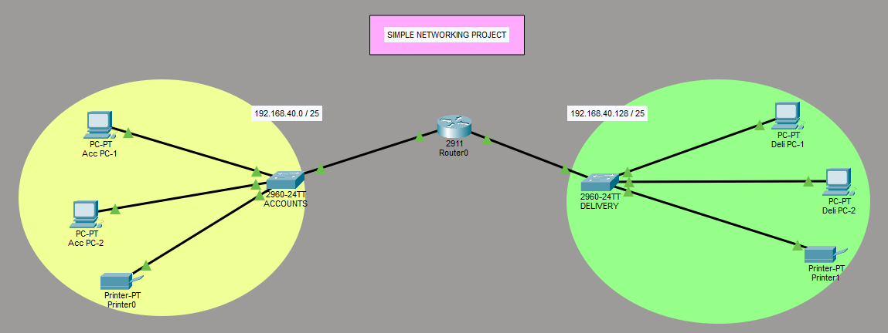
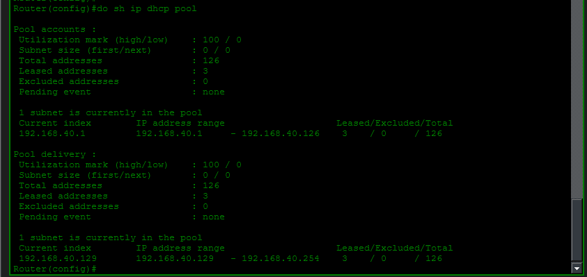
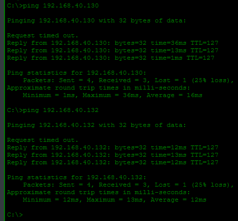

# 📡 Simple Networking Project (DHCP & Inter-Subnet Routing)

## 📌 Project Overview

This project demonstrates a basic network setup using:

* DHCP configuration
* Subnetting
* Router-based communication between networks

The network is divided into two subnets:

* **Accounts: 192.168.40.0/25**
* **Delivery: 192.168.40.128/25**

---

## 🧱 Network Topology



---

## ⚙️ Technologies Used

* Cisco Packet Tracer
* Router (2911)
* Switches (2960-24TT)
* PCs & Printer
* Concepts:

  * DHCP
  * Subnetting
  * Basic Routing

---

## 🌐 IP Addressing Scheme

| Network        | Subnet Mask | IP Range                        |
| -------------- | ----------- | ------------------------------- |
| 192.168.40.0   | /25         | 192.168.40.1 – 192.168.40.126   |
| 192.168.40.128 | /25         | 192.168.40.129 – 192.168.40.254 |

---

## 🚀 Features Implemented

### ✅ DHCP Configuration

* Router assigns IP addresses dynamically
* Two DHCP pools created:

  * `accounts`
  * `delivery`

📸 **DHCP Pool Output**


---

### ✅ Connectivity Testing

* Devices successfully receive IP addresses
* Communication verified using ping

📸 **Ping Test Results**


---

### ✅ Subnetting

* Network divided into two /25 subnets
* Efficient IP utilization

---

### ✅ Routing Between Subnets

* Router enables communication between both networks

---

## 🛠️ How to Run This Project

1. Open Cisco Packet Tracer
2. Load the `.pkt` file
3. Verify DHCP configuration:

   ```
   show ip dhcp pool
   ```
4. Test connectivity:

   ```
   ping 192.168.40.x
   ```

---

## 📷 Project Screenshots

### 🔹 Topology


### 🔹 DHCP Configuration


### 🔹 Ping Verification


---

## 📈 Learning Outcomes

* Understanding subnetting (/25)
* Configuring DHCP on Cisco router
* Basic routing between subnets
* Verifying network connectivity

---

## 👤 Author

** Mohana Chidambaram **
